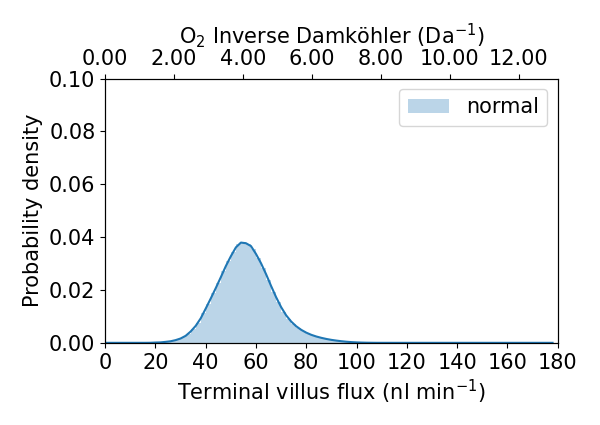
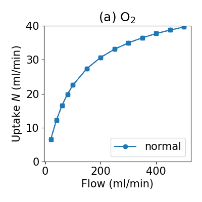

==================================================================================
Example - Model from Clark Whitfield et al. 2024, whole placenta nutrient exchange
==================================================================================
This example describes a feto-placental nutrient transport model, which predicts the distribution
of exchange and nurtrient uptake in an anatomical feto-placental geometry.

This example is found in the directory placenta-simulations/fetoplacental/nutrient_transport

Requirements
============

The example requires that you have the reprosim libraries installed on your machine. You can find installation instructions
`here <https://reprosim.readthedocs.io/en/latest/index.html#>`_ and the libraries themselves `here <https://github.com/virtualPregnancy/reprosim>`_.

You need to have python installed, and Julia (https://julialang.org/). Make sure you add the Julia install to PATH.

You also need to properly install `pyjulia <https://pyjulia.readthedocs.io/en/latest/installation.html>`_ (note that this is more complicated than a simple pip install).

You will need other python libraries. These are listed under pyrequirements.txt in the model example directory.

Within Julia you will need to do the following:

.. code-block:: julia

    import Pkg
    Pkg.add("SpecialFunctions")
    Pkg.add("Distributions")

Step 1 - run perfusion models
=============================

There is a shell script provided to run the perfusion model multiple times under a range of different inlet flow conditions.
The shell script is called: step1_run_multiple_bloodflow.sh

To run the shell script simply type into a terminal:

.. code-block:: console

    ./step1_run_multiple_bloodflow.sh

Inside the shell script you will find a series of terminal commands. First we generate a list of inlet blood flows (in ml/min)
that we want to simulate, and then we loop through this list and run the run-bloodflow.py script multiple times with
inlet arguments $i for flow, and 0.0 for fractional vessel occlusion (this allows us to manipulate vessels by blocking then off).
In this example we keep the screen dumps from running the python script in a text file and move these text files to the output
directory when we run the python script. Finally, we move all out model outputs to a single output directory for processing.

.. code-block:: console

    list=(20.0 40.0 50.0 60.0 80.0 100.0 150.0 200.0 250.0 300.0 350.0 400.0 450.0 500.0)
    for i in ${list[@]}
    do
        echo $i
        python run-bloodflow.py $i 0.0  > screen_$i.txt
        mv screen_$i.txt output_flowbc_${i}ml_min_0.0
    done
    mkdir output-normal
    mv output_flowbc_* output-normal/.

The main bulk of the python script run-bloodflow.py is described in other examples. Here we just run through the main differences compared to what has been
considered before. First, our python script has input arguements:

.. code-block:: python

        blood_flow_ml = float(args[0])
        remove_frac = float(args[1])
        blood_flow_model_units = blood_flow_ml / 60. * 1000.
        print(blood_flow_ml, blood_flow_model_units, remove_frac)

In python these are defined as args. The first argument is inlet blood flow in ml/min (converted to model units of mm:math:`^3`/min in the python code, and the second gives the
option to remove some fraction of vessels of a given Strahler order at random. By default we use 0.0 here, unless we want to manipulate and remove vessels.

We use a new capillary model 'erlich resistance' which instructs reprosim to use terminal villous resistance in perfusion simulations following prior
studies based on anatomical imaging.

.. code-block:: python

    capillary_model = 'erlich_resistance'

We also set rheology and vessel types to reflect a non-linear (Pries model) rheology, and compliant vessels:

.. code-block:: python

    rheology_type = 'pries_vessel'
    vessel_type = 'elastic'

Finally, if we had included a non-zero fraction of vessels to occlude, we could instruct reprosim to do this, at any given Strahler order, if you are interested
you can change the occlusion fraction and Strahler order to explore effects of doing this.

.. code-block:: python

    if remove_frac > 0.0:
        print("Occluding order 6 vessels")
        update_radius_by_order(6, 0.01, 'random', remove_frac)

Running the shell script will create a host of files in the output-normal directory:

.. code-block:: console

    output_flowbc_100.0ml_min_0.0	output_flowbc_40.0ml_min_0.0
    output_flowbc_150.0ml_min_0.0	output_flowbc_400.0ml_min_0.0
    output_flowbc_20.0ml_min_0.0	output_flowbc_450.0ml_min_0.0
    output_flowbc_200.0ml_min_0.0	output_flowbc_50.0ml_min_0.0
    output_flowbc_250.0ml_min_0.0	output_flowbc_500.0ml_min_0.0
    output_flowbc_300.0ml_min_0.0	output_flowbc_60.0ml_min_0.0
    output_flowbc_350.0ml_min_0.0	output_flowbc_80.0ml_min_0.0

Step 2 - convert perfusion model outputs to nutrient transport model inputs
===========================================================================

This step is currently required to convert University of Auckland perfusion model outputs to University of Manchester exchange model inputs. In a console
simply run:

.. code-block:: console

    python step2_data_conversion.py

This script will create two files in your output-normal directory:

.. code-block:: console

    tree_flux_sweep.pbz2
    tree_flux_sweep_terminal.pbz2

Step 3 - run nutrient transport model
=====================================

The next step is to run the nutrient transport model:

.. code-block:: console

    python step3_nutrienttransport.py

First we import required python packages, including the julia code which solves the model:

.. code-block:: python

    from julia import Main
    Main.include("./scripts/calculate_villous_fluxes.jl")
    import numpy as np
    import sys
    sys.path.append('./scripts')
    import placenta_calculations as pcalc

Next, we need to define output diretories, the inlet flux values we are intterested in, and properties of the placental micro-vascular tree

.. code-block:: python

    TreeFilenames = ["normal"]
    outputdir = 'output-normal/'
    inputdir = outputdir
    flux_vals = np.array([20,40,60,80,100,150,200,250,300,350,400,450,500],dtype=float)
    Nparallel = 1        #Number of convolute units in parallel
    Nseries = 3          #Number of terminal villi in a row from a single mature intermediate villous
    Nparallel_cap = 1    #Number of parallel capillaries in an imaged convolute (leiser), typically 1
    Nconv = 10       #as per leiser 10 terminal conduits in a single feeding vessel (typically 10)
    Ngens = 3   #Typically 3
    tree_path = outputdir+'/tree_flux_sweep.pbz2'
    term_path = outputdir+'/tree_flux_sweep_terminal.pbz2'
    villous_flux_dir = outputdir

We load in our terminal flow results from our perdusion simulations:

.. code-block:: python

    term_props = Main.load_pickle(decompress(term_path))

and we calculate nutrient flux for each terminal unit, under each flow condition:

.. code-block:: python

    Main.calculate_and_save_allfluxes(outputdir,
                    term_props[0], TreeFilenames, flux_vals,
                    Nparallel, Nseries, Nparallel_cap, Nconv, Ngens, use_full_res=True)

Finally we calculate and save all model output measures interest, at any given flow inlet value (here 250 ml/min)

.. code-block:: python

    vtk_print_fluxes = np.array([250])    #flux value to produce vtk file for
    pcalc.calculate_and_save_measures(outputdir+"/flux_sweep_outcomes.pkl", \
        tree_path, term_path, villous_flux_dir, ['normal'], ['normal'], \
        pcalc.SoluteNames, pcalc.DC, pcalc.B, pcalc.Dt, Nparallel, Nseries, Nparallel_cap, Nconv, Ngens, \
        vtk_print_fluxes)

Your output-normal directory should now contain a number of files and sub-directories:

.. code-block:: console

    normal_np1ns3_flux_250_term.vtk	tree_flux_sweep.pbz2
    normal_np1ns3_flux_250_tree.vtk	tree_flux_sweep_terminal.pbz2
    output_flowbc_100.0ml_min_0.0	tv_fluxes_normal_flow100.pkl
    output_flowbc_150.0ml_min_0.0	tv_fluxes_normal_flow150.pkl
    output_flowbc_20.0ml_min_0.0	tv_fluxes_normal_flow20.pkl
    output_flowbc_200.0ml_min_0.0	tv_fluxes_normal_flow200.pkl
    output_flowbc_250.0ml_min_0.0	tv_fluxes_normal_flow250.pkl
    output_flowbc_300.0ml_min_0.0	tv_fluxes_normal_flow300.pkl
    output_flowbc_350.0ml_min_0.0	tv_fluxes_normal_flow350.pkl
    output_flowbc_40.0ml_min_0.0	tv_fluxes_normal_flow40.pkl
    output_flowbc_400.0ml_min_0.0	tv_fluxes_normal_flow400.pkl
    output_flowbc_450.0ml_min_0.0	tv_fluxes_normal_flow450.pkl
    output_flowbc_50.0ml_min_0.0	tv_fluxes_normal_flow500.pkl
    output_flowbc_500.0ml_min_0.0	tv_fluxes_normal_flow60.pkl
    output_flowbc_60.0ml_min_0.0	tv_fluxes_normal_flow80.pkl

Step 4 - plot some results!
===========================

Now, we get to look at results, note that when you become familiar with data structures you will be able to plot results however you see fit.

.. code-block:: console

    python step4_plotting.py

This will produce two png figures in your output-normal directory

